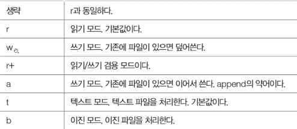

# 8일차 

## 7일차 메인 복습

```
1.
calculator 이라는 모듈파일을 만든다.(참조될 파일)
def add(a, b):
    return a+b

def sub(a,b):
    return a-b

def div(a,b):
    return a/b

def mul(a,b):
    return a*b

def mod(a,b):
    return a%b

2.
module3 파일에서 calculator 모듈을 참조 하여 결과값을 낸다.이럴경우 module3이 메인이 된다
import calculator
print(calculator.add(10,3))


4.
maintest3 파일을 새로 만는다. 여기서 module3 파일을 참조하면 메인은 maintest3가 된다.

import module3
print("moduleTest")

5. 
이 코드를 실행하면 메인인지아닌지 확인이 가능하다 이 코드를 친 파일이 메인이라면 이 코드가 실행 될 것이고 아니라면 실행 자체가 안된다 하지만 else 를 처서 만약 아니라면 print("아님")이라는코를 추가한다면 아님이라고 뜬다 (if __name__ == "__main__":)

if __name__ == "__main__":
        input_name()
        print(get_name())
        
        
```

## 8일차 메인시작

```
1.
module_main 파일 작성 출력하면 이름 입력이뜬다

name =''

def input_name():
    global name
    name = input('이름입력: ')

def get_name():
    if name=='':
        return '이름없음'
    else:
        return name

if __name__ == '__main__':
    input_name()
    print(get_name())
else:
    print("moduel_main이 imort")
    

2.
module_main_import(메인) → module_main을 참조 파일 작성
출력하면 이름입력,module main을 impor,moduel_main이 imort 출력된다 왜냐하면 참조 당한 파일은 메인이
아니여서 else 작성한 print("moduel_main이 imort")가 출력 될 것이다.  module_main_import가 참조를 했기 때문에 메인이 된다.

import module_main

print("module main을 import")
module_main.input_name()
print(module_main.get_name())


```

> 가위바위보 게임

### ggbGame(참조될 파일) - 상위폴더 등록하기

```python
from random import randint

def gbb_game(you_n):
    comN = randint(1,3)
    if comN - you_n ==1 or comN - you_n == -2:
          print("컴퓨터가 이겼습니다.")
    elif comN == you_n:
        print("비김")
    else:
        print("내가이겼습니다.")
    print("COM : %d" % comN)

def input_num():
    you = int(input("YOU입력 (1:가위, 2:바위, 3:보:)"))
    gbb_game(you) #맨위에  gbb_game(you_n)로 매개 변수를 입력해주는것!
```

### module_practice(참조 할 파일)

```python
import ggbGame     # ggbGame 참조하기
def main():        
    ggbGame.input_num()

if  __name__ == "__main__":
    main()  # 여기가 메인이여서 가위바위보가 실행된다.
```

> 패키지 모듈을 모아둔것
>
> 패키지는 디렉터리 안에 \__init__\.py 존재 (빈파일)
>
> 패키기를 사용할 경우 모듈 import
>
> import 패키지.모듈
> import 패키지.모듈 as 별칭
> from 패키지.모듈 import 함수
> from 패키지.모듈 import **
>
> 패키지를 파이참 구성하는 방법
> [파일]-[New]-[Python Package]- package 이름 입력
> 패키지가 생성되면  \__init__\.py  확인
>
> 패키지 모듈 추가
>
> 패키지를 파이참 구성하는 방법
> [파일]-[New]-[Python Package]- package 이름 입력
> 패키지가 생성되면 __init__.py 확인

### package(패키지 활용)

```
import 패키지.모듈           먼저 패키지 파일을 등록해야한다.
import mypack.pack1.module11 임폴트.my팩키지.팩키지.파일 순으로

mypack.pack1.module11.func11() my팩키지.팩키지.파일() 하면 출력

import 패키지.모듈 as 별칭         
import mypack.pack1.module11 as mm1 임폴트.my팩키지.팩키지.파일 as 명칭(mm1)
                                         
mm1.func11()    명칭으로 출력 가능하다.

from 패키지.모듈 import 함수
from mypack.pack1.module12 import func12  프롬 my팩키지.팩키지.파일 모듈 함수
from mypack.pack1.module11 import func11, func111

# func12()                함수만 치면 바로 가능하다.

# from 패키지.모듈 import *   

from mypack.pack1.module11 import * 프롬, my팩키지, 파일 임폴트 *
func11()                   모듈안에 모든 함수 사용가증! 함수만쳐도
func111()
```


###  리스트 컴프리헨션

```
예. 정수 0~9까지의 값을 갖는 리스트를 생성하시오.

result = []
for i in range(10):
    result.append(i)
print(result)

# list comprehension : 리스트 요소 생성
result2 = [i for i in range(10)]  # i가 append역할
print(result2)


# 예. 짝수만 리스트로 생성 : 필터링

result = []
for i in range(10):
    if i%2==0:
        result.append(i)
# print(result)

# list comprehension : 리스트 요소 필터링
result2 = [i for i in range(10) if i%2==0]     if를 맨뒤로 보내도됨
# print(result2)

result3 = [i if i%2==0 else -1 for i in range(10)]  if 문자를맨앞으로 보낼땐 
														else 필수 i는 고정
# print(result3)

# list comprehension : 중첩 반복문
list1 = ['a','b','c']
list2 = ['D','E','a']

result = []
for i in list1:
    for j in list2:
        result.append(i+j)

result = [i+j for i in list1 for j in list2]  
result = [i+j for i in list1 for j in list2 if not(i==j)]
print(result)

words = 'Remember to let her into your heart'.split()
print(words)

result =[[w.upper(), w.lower(), len(w)] for w in words] 메소드 할때는 W.
print(result)

result =[(w.upper(), w.lower(), len(w)) for w in words]
print(result)
```

###  변수 앞에 붙은 경우 *args, **kwagrs => 언패킹(unpacking)

 *args 튜플 리스트  () []

**kwagrs 디셔너리 {}

```
def asterisk_test1(a, *args):   a, 튜풀로 합쳐서 출력 *이 없음
    print(a, args)              튜풀로 합쳐서 출력 *이 없음
    print(type(args))

def asterisk_test2(a, *args):     
    print(a, *args)           그냥 숫자로 출력 *이 있음
    print(type(args))

asterisk_test1(1,2,3,4,5)
asterisk_test2(1,2,3,4,5)

# a, b, c=[1,2,3]
a, b, c=([1,2,3],[3,4,5],[5,6,7])     리스트로 출력
print(a,b,c)
data = ([1,2,3],[3,4,5],[5,6,7])    리스트로 출력 *빼면 튜플로출력
print(*data)

def asterisk_test3(a, **args):  딕셔너리 출력 
    print(a, args)               *넣으면 딕셔너리 안더ㅣㅁ
    print(type(args))

asterisk_test3(1,b=2,c=3,d=4,e=5)

data2 = {'b': 2, 'c': 3, 'd': 4, 'e': 5}     딕셔너리 딕셔너리 출력
asterisk_test3(1,**data2)
```

###  파일생성

읽기용: 변수명 = open("파일명", "r")

쓰기용:변수명 = open("파일명", "w")
clise() 무조건해줘야한다.




