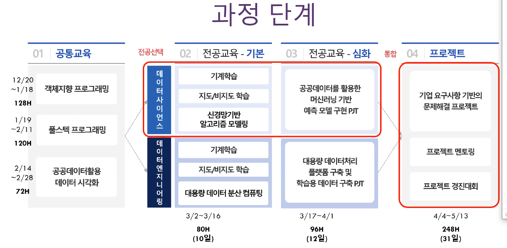

빅데이터 테파 익사 바이트  규모가

형태 웹 데이터 사진 음향파일 비디오 파일 실시간 데이터 비정형 데이터 

속도  실시간처리 

3v

정확성 

가치 

2v

타당성

휘발성 

2v 

수집 저장 처리 

수집 

하둡 스파크  하려면 리눅스를 알아야 한다. 

답변

케이스 바이 케이스

열심히 노력해야하는거

기본적으로 하둡기반!

자바 파이썬을 많이씀 많이씁 

열심히 해야한다.

SQLD

가공만하는회사는 에바참치

작업하나하나 작성해서 내 능력을 보여준다

마이테이터

하나은행 이나 

뱅크샐러드

마이데이터는 = 빅데이터다!

열심히 하기!

데이터 엔지니어 사이언스 분반정도 

사이언스: 분석

엔지니어 : AWS, 구축 

공통프로그램 :2.14 ~ 2. 28일

융합 프로젝트 협업 기반 프로젝트

## 데이터 엔지니어

1. 빅데이터 배움
2. 수집 저장 처리(엔지니어)

3. ELK스택
4. spark (파이선, 자바 가능)
5. 하둡기반
6. 수집 구축 던저주기
7. sqld 따면 좋음
8. R
9. 머신러닝 배움
   1. 오라클 데이터 베이스 알디비
   2. 몽도디비 디비 노 에스큐앨 비전형 이야기
   3. 리눅스(하둡, 스파크)
10. 스파크배움 
11. 리눅스 서버 안에서 데이터 가지고 와서 저장 새로운데이터를 주는 역할
12. 백엔드 리눅스 서버위에 엔지니어 서버 요청하면 응답해주는 역할
13.  

이 그림을 기반으로 포토 폴리오 하면 좋음 